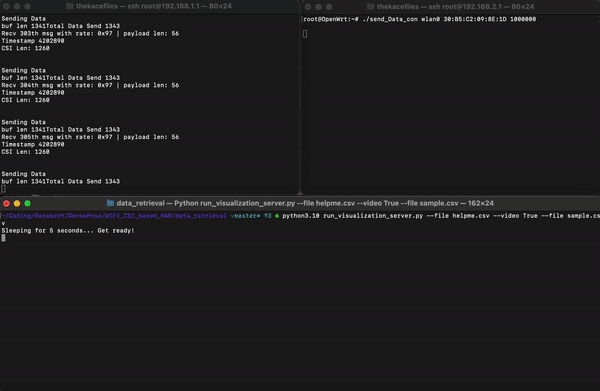

# Overview of CSI

Channel State Information, or CSI, is a complex number that represents how a wireless signal propagates from the transmitter to the receiver. It is calculated across each [OFDM](https://en.wikipedia.org/wiki/Orthogonal_frequency-division_multiplexing) subcarriers and considers the effect of reflection and scattering. The CSI of the transmitted packet represents a complex matrix of size `MxNx56` where `M` is the total # of transmitters and `N` is the total # of receivers. The  TP-Link Archer C7 V2 has 3 antennas and thus transmits a CSI matrix of 3x3x56 at each 20MHz channel bandwidth. Below represents an example structure of a transmitted CSI packet: 


*Note: Sometimes the shape can be smaller due because of how the driver selects the antennas in the 802.11n standard*

More Resources:
- [Atheros CSI Tool](https://wands.sg/research/wifi/AtherosCSI/)
- [Practical Issues and Challenges in CSI-based
Integrated Sensing and Communication](https://arxiv.org/pdf/2204.03535.pdf)

# Gathering CSI Data

On each individual router, we want to execute `recv_csi` and `send_Data_con`. If you have one computer, one of the router should be connected through the Ethernet port and the other through WiFi. You should be able to open 2 terminals and `ssh` into both routers at the same time.

For `send_Data_con`, it takes in three parameters:
- `<INTERFACE>` - The router interface to use (should be wlan0)
- `<MAC_ADDRESS>` - The MAC address of the device to send the packet to (should be the MAC address of the other router)
- `<INTERVAL>` - The amount of packets to send every μs

Example Usage: `./send_Data_con wlan0 30:B5:C2:09:8E:1D 10000` 

&nbsp;  

For `recv_csi`, it takes in two parameters:
- `<IP_ADDRESS>` - The IP address of the device to connect to (should be your computer)
- `<PORT>` - The port number

Example Usage: `./recv_csi 192.168.1.140 60000` 

&nbsp;  

Let's send the package at a rate of 1 package per second and send it to port 60001.

On the sender router, run the following command:

```bash
./send_Data_con wlan0 <MAC_ADDRESS> 1000000
```

Then on the receiver router, run the following command:

```bash
./recv_csi <COMP_IP_ADDRESS> 60001
```

&nbsp;

We can then run a Python program called `run_visualization_server` that connects to the UDP socket of the receiver router and processes the receiver packets real-time. The most important command line options are the following:
- `--file` - The name of the csv file to save the raw phase & amplitude
- `--photo` - Either `True` or `False` determining whether to save a picture for 
- `--port` - The port number to listen on
- `--video` - Either `True` or `False` determining whether to record a video or not. You will need a camera connected to your device and may need to adjust `cam = cv2.VideoCapture(...)` to select the correct camera
- `--max-frames` - The total number amount of frames to record. By default, the camera writes 500 frames at 20 fps, totaling 25 seconds of footage

Open another terminal and navigate to `WIFI_CSI_based_HAR/data_retrieval`. Run the following command:

```bash
python run_visualization_server.py --port 60001 --video True --file sample_data.csv
```

You should see the raw amplitude and phase plotted real-time:



The raw amplitude and phase are logged into `data/tmp/sample_data.csv`, where each row is structured like so:

| Number Channels (1)|  Timestamp (2) | Raw Amplitudes (3 - 507)| Raw Amplitudes (508 - 1012) |
| -----------| ----------- | ----------- | ----------- |
| 56 | 1219267055 |  73.7563556583431 ... |  -1.65927439927587 ... |   
| 56 | 1219267120 |  74.2428447730823 ... |  -0.11575921772081 ... |   
| ... | ... |  ... |  ... |   

*Note: 3x3x56 (504) amplitudes and phases are outputted* 

Additionally, the recording `video.mp4` outputted into the `data_retrieval` folder, which will be evaluated by the Densepose network for the feature maps for our WiFi Densepose network to learn.


 