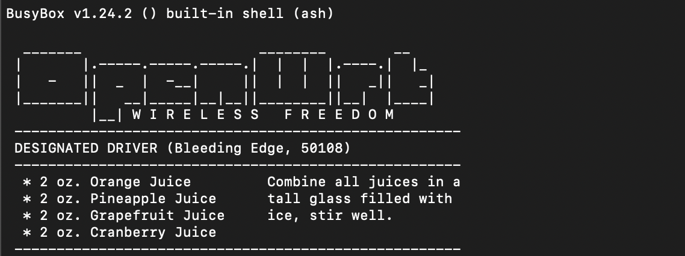

## Router Setup

*Note: The instruction are specifically for TP-Link Archer C7 V2*

Two routers are necessary, one to be the transmitter and the other the receiver. I went with the one mentioned in the paper, the TP-Link AC1750 (specifically V2). We specifically want to access the Channel State Information (CSI) using the [Atheros CSI Tool](https://wands.sg/research/wifi/AtherosCSI/), which requires the [OpenWrt](https://openwrt.org/) firmware installed onto both routers. We can find our specific build for our router [here](https://firmware-selector.openwrt.org/?version=22.03.5). For my build, I used the following [link](https://downloads.openwrt.org/releases/22.03.5/targets/ath79/generic/openwrt-22.03.5-ath79-generic-tplink_archer-c7-v2-squashfs-factory-us.bin). 

In order to flash the router, we now want to have an Ethernet cord connected from the router Ethernet port to the computer. We can access the default web interface of our router by typing in the router's IP address `http://192.168.0.1` into a web browser. We will then enter the router's default login credentials (which is usually found on the sticker). From there, under `System Tools` -> `Firmware Upgrade`, we can select our OpenWrt firmware. Make sure the OpenWrt binary file is the correct build, or else you risk bricking your router. 

Then click "Upgrade" and wait until the firmware is **fully** installed and reboots itself. We should be able to access `http://192.168.1.1` through the web browser and access OpenWrt's LuCi web interface. 

There are several things we should do to making the process of running the CSI programs smoother and for security practices:

- Set a new administrator router password.
- Under `Network` -> `Interfaces` -> `Edit` (LAN) -> `General Setup`, make a note of the MAC Address and IPv4 address on both routers, and change one of the router's IPv4 address to be something different from the other router. This is so that we can later `ssh` into both routers at the same time.


- Under `Network` -> `Wireless` -> `General Setup` (Device Configuration), make sure that Wireless network is enabled.


- Under `Network` -> `Wireless` -> `General Setup` (Interface Configuration), set the ESSID to be something distinguishable and memorable (both routers). This is the name of the network displayed.


- You should also set a WPA2-PSK password under the `Wireless Security Tab` to prevent anyone from accessing your network.


&nbsp;  

Now that we have both routers set up, we can start compiling programs to both routers.

## Cross-Compiler

It is recommended that you use a GNU/Linux operating system like Debian or Ubantu for building the cross-compiler.

Follow the build instructions [here](https://openwrt.org/docs/guide-developer/toolchain/install-buildsystem) for your operating system. Then run the following commands in your terminal, which are updated and modified from OpenWrt's [instructions](https://openwrt.org/docs/guide-developer/helloworld/chapter1).

```bash
git clone https://git.openwrt.org/openwrt/openwrt.git  
cd openwrt

# Checkout the latest stable version
git checkout v22.03.5

# Update the feeds  
./scripts/feeds update -a  
./scripts/feeds install -a 

# Configure the firmware image and the kernel  
make menuconfig  
```

You should see a menu that looks like so:


Set up the following configuration:
- Set the `Target System` to be `ATH79`
- Set the `Target Profile` to be `Archer C7 v2`
- Then save the configuration

Then run the following command:
```bash
make -j$(nproc) kernel_menuconfig 
make -j$(nproc) defconfig download clean world
```

This step will take a while to finish, so grab a coffee or take a quick walk around the building!


Once the toolchain is finished compiling, we can add a PATH to our newly created toolchain, which will be used by the Atheros CSI Tool.

```
# Note: toolchain-mips_24kc_gcc-11.2.0_musl might be different depending on what version of 
# OpenWrt and toolchain you use

export PATH=$PATH:$(pwd)/staging_dir/toolchain-mips_24kc_gcc-11.2.0_musl/bin
export TOOLCHAIN_DIR=$(pwd)/staging_dir/toolchain-mips_24kc_gcc-11.2.0_musl
```

## Compiling the Atheros CSI Tool

We can use a modified version of the [Atheros CSI Tool](https://github.com/xieyaxiongfly/Atheros_CSI_tool_OpenWRT_UserSpaceApp_src), which allows our computer to listen to the received packet and process the CSI real-time. 

Run the following commands in your terminal:

```bash
cd ../ # Move out of the openwrt directory
git clone https://github.com/DoubleTrio/WIFI_CSI_based_HAR
cd WIFI_CSI_based_HAR/router/
cd recvCSI
```

You should be able to run `make` and a binary file called `recv_csi` should appear in the directory. We can send this program to one of our routers through the `scp` command below: 

*Note: You should be connected to the router through the Ethernet port or WiFi connection.*

```bash
scp recv_csi root@<IP_ADDRESS_OF_ROUTER>:/root
```

You can confirm that the executable was copied over successfully by logging into the router with the `ssh` command.

```bash
ssh root@<IP_ADDRESS_OF_ROUTER>
```



Then check that the executable exists with the `ls` command.
```
root@OpenWrt:~# ls
recv_csi
```

Once you confirm that the executable exist, you can quit out of the shell by typing the command `exit`.

On the other router, we want to compile the program that sends the CSI package, like so:

```bash
cd ../ # Move out of the recvCSI directory
cd sendData
make # Note: two executable files will appear: send_Data and send_Data_con
scp send_Data_con root@<IP_ADDRESS_OF_OTHER_ROUTER>:/root
```

Now that you have both the sender and receiver programs on both routers, we can begin collecting the CSI data!